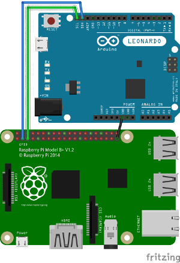

# Hardware-Bruteforce-Framework-2

Currently under developpement (but as Apache said: it works!).

Needs: 
- a RaspberryPi or something equivalent supporting Linux and i2c
- an Arduino supporting Keyboard.h and Mouse.h (Arduino Leonardo for example) or a Teensy 2.x/3.x.
- 3 wires in order to connect Pi and Arduino
- Optional: an USB webcam (RaspiCam is too slow)

Targets and wordlists support:
- BIOS only supported on Teensy 2.x
- Unicode only supported on Teensy 3.x

Installation (Pi part):
- configure i2c using raspi-config
- apt-get install imagemagick fswebcam i2c-tools
- optionnal (for WOL): apt-get install scapy
- reboot
- git clone https://github.com/cervoise/Hardware-Bruteforce-Framework-2.git
- cd Hardware-Bruteforce-Framework-2/Raspberry

Installation (Arduino/Teensy part):
- push the Arduino project from Arduino folder.

Wiring:
- Connect your Raspberry Pi and Teensy/Arduino SDA, SCL, and GND pins together

RPI B & Leonardo:

RPI B+ & Leonardo:

RPI B+ & Teensy 3.0:

